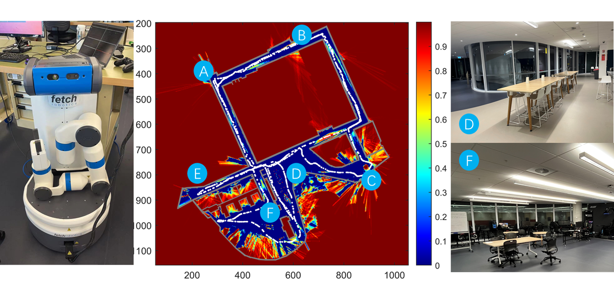

### BKIO-Exploration

- This repo is reserved for the example code of our newly accepted paper "CARE" in RA-L 2023 [1].
- This paper mainly presents a highly efficient information gain (Confidence-rich mutual information, CRMI [2]) evaluation and inference method for CRMI-based autonomous robot exploration in *priori* unknown areas.
- The video link is [here](https://youtu.be/sOW4fuaAwT8).

Figure: Real-world exploration experiments in UTS CB02.11 using a Fetch robot.

**References**:

[1] Y. Xu, R. Zheng, S. Zhang, M. Liu, and S. Huang , "CARE: Confidence-rich autonomous robot exploration using Bayesian kernel inference and optimization'', *IEEE Robotics and Automation Letters*, 2023, accepted.

[2] Y. Xu, R. Zheng, M. Liu, and S. Zhang, "CRMI: Confidence-rich mutual information for information-theoretic mapping'', *IEEE Robotics and Automation Letters*, vol. 6, no. 4, pp. 6434–6441, 2021.
